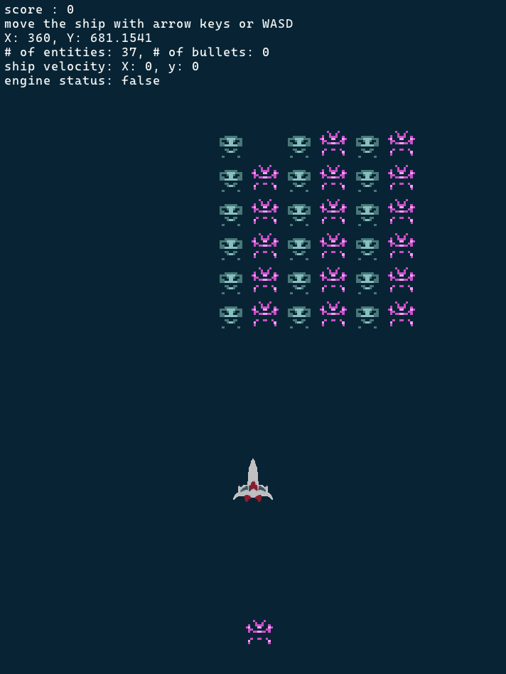

# Smol Invaders

Make sure to clone this repository recursively!
```
git clone https://github.com/Shr1ftyy/smol-invaders --recursive
```

If you have cloned it non-recursively:
```
git submodule update --init
```

# TODO
- [x] ECS
- [x] Player
- [x] Simple enemies
- [x] Flying enemies
- [ ] Score
- [ ] Simple gameplay loop

# Preview


